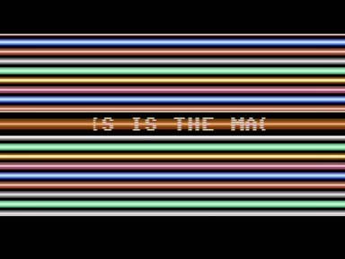
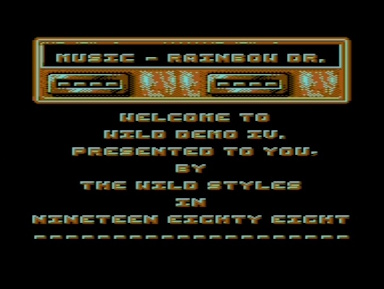
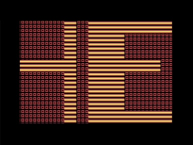
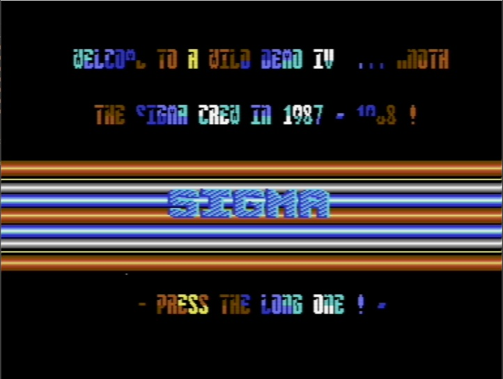
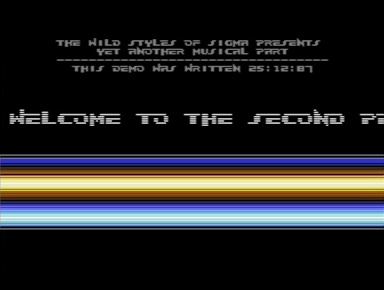
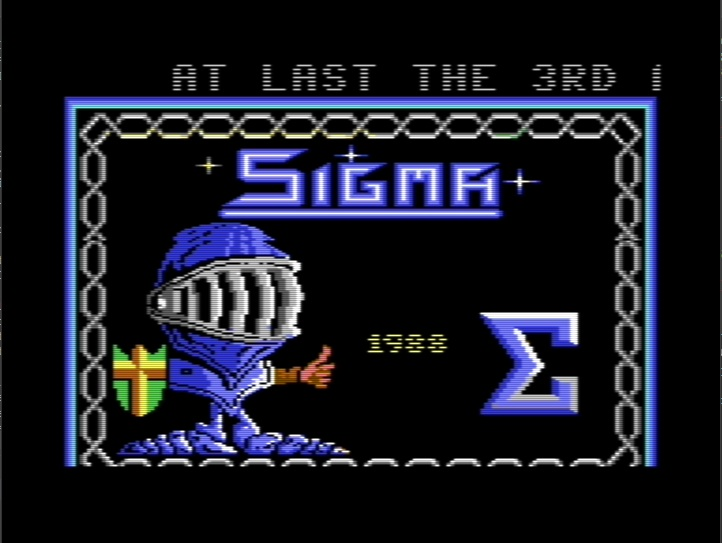

# C64-Demo-Code
A collection of reverse engineered Commodore 64 demo source code written back in the mid 80's !

The source code can be debugged using the VSCode VS64 extension and the ACME compiler.

## ThunderCats Music Rip Intro

## Wild Demo IV

