# C64-Demo-Code
A collection of reverse engineered Commodore 64 demo source code written back in the mid 80's !

The source code can be debugged using the VSCode VS64 extension and the ACME compiler.

## ThunderCats Music Rip Intro

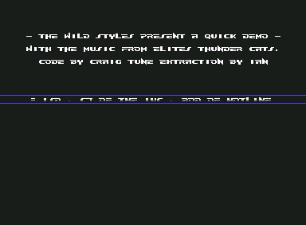

## Wild Demo I

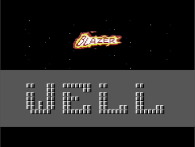

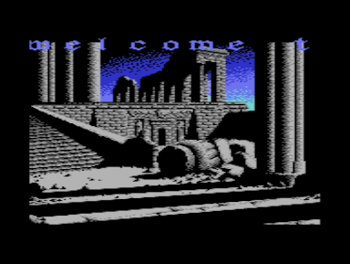

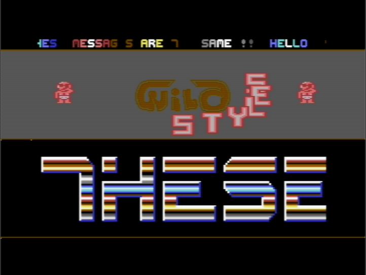

## Wild Demo II

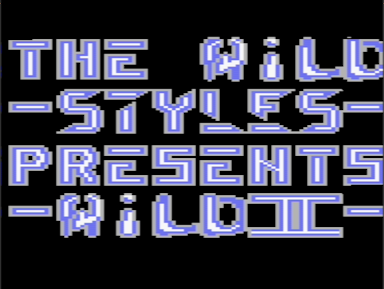

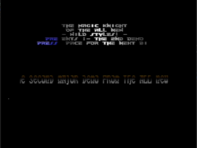

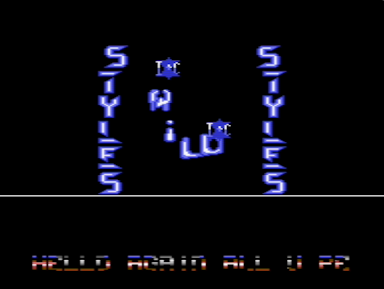

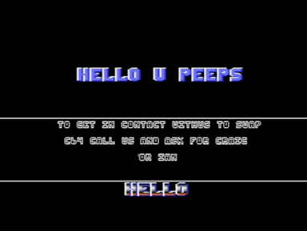

## Wild Demo III

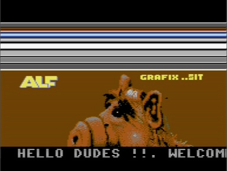

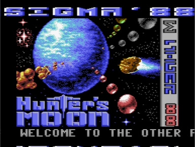

## Wild Demo IV

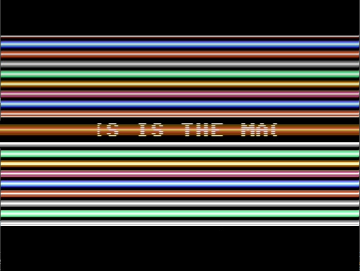

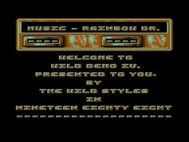

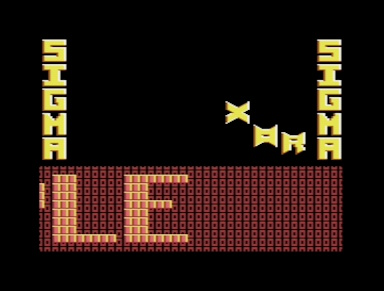

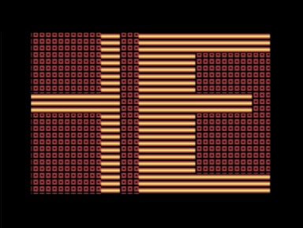

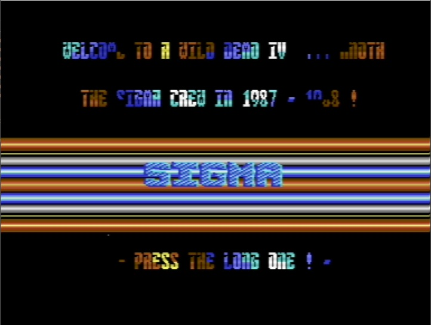

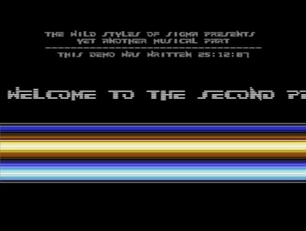

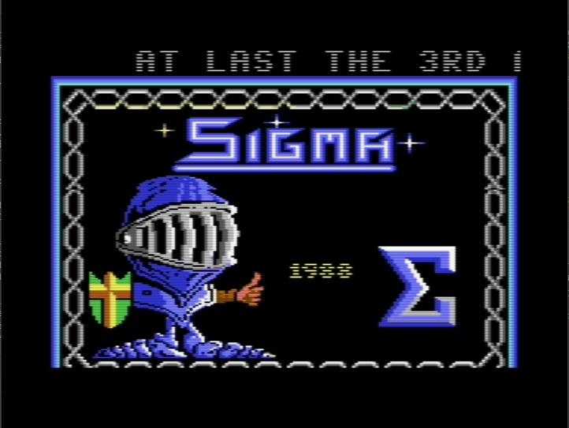

## Generic 3532

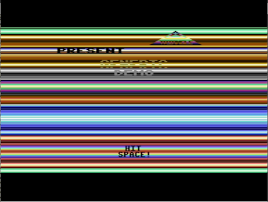

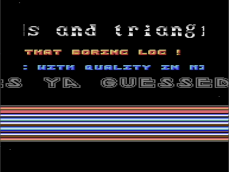

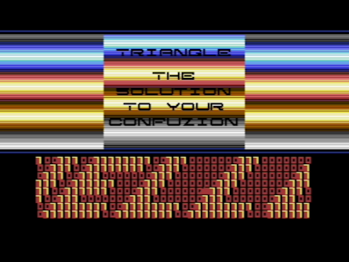

## JetBoys Cracktro

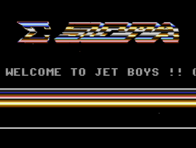

## Trantor Cracktro

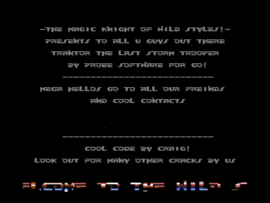

