# C64-Demo-Code (WIP)
A collection of reverse engineered Commodore 64 demo/intro source code written back in the late 80's !

The source code that is available can be debugged using the VSCode VS64 extension and the ACME compiler.
 I am working my through reverse engineering each demo/intro ...

## ThunderCats Music Rip Intro
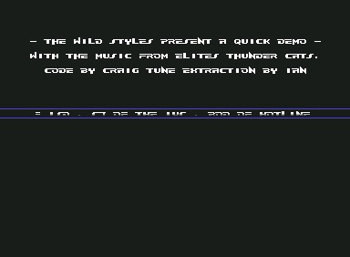

## Wild Demo I
### Part-1:  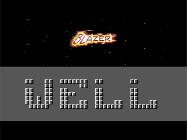
### Part-2:  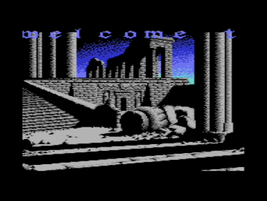
### Part-3:  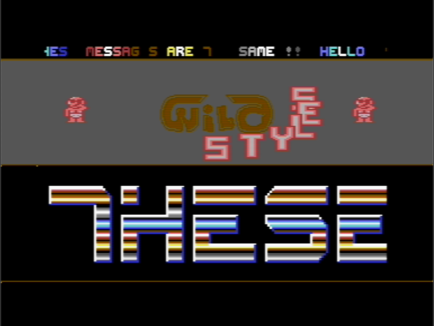

## Wild Demo II
### Part-1:  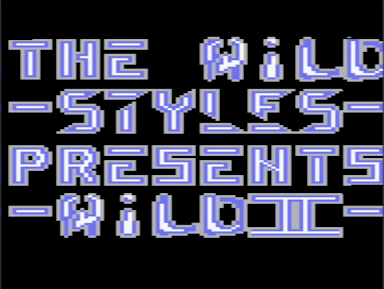
### Part-2:  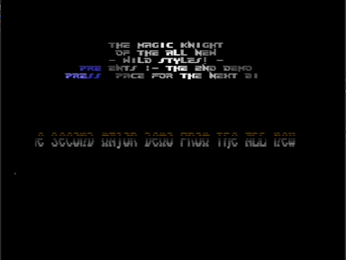
### Part-3:  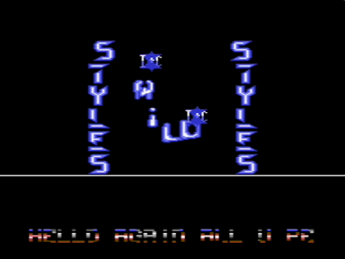
### Part-4:  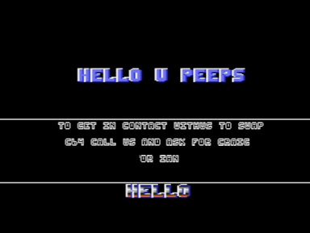

## Wild Demo III
### Part-1:  
### Part-2:  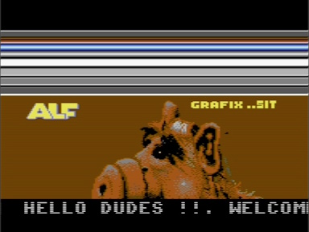
### Part-3:  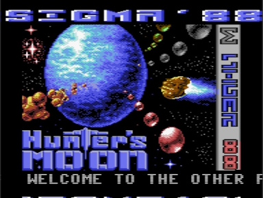

## Wild Demo IV
### Part-1:  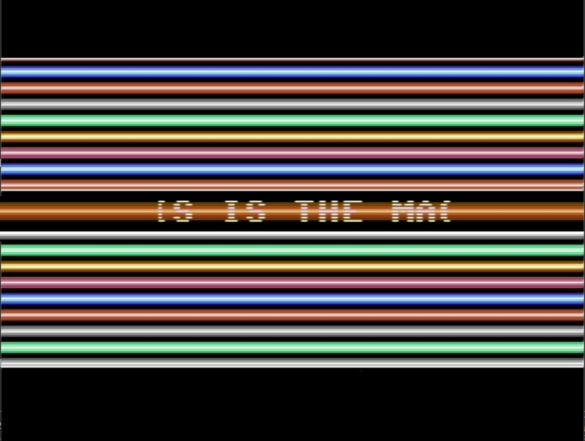
### Part-2:  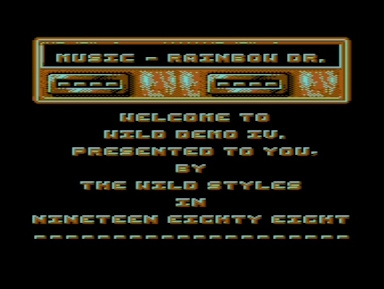
### Part-3:  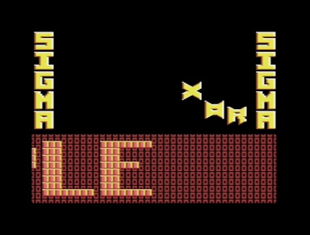
### Part-4:  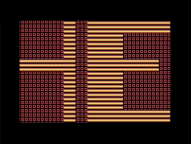
### Part-5:  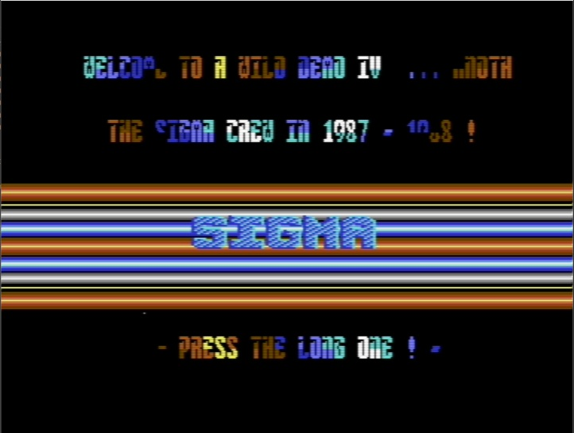
### Part-6:  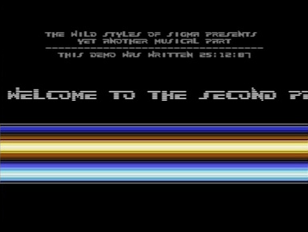
### Part-7:  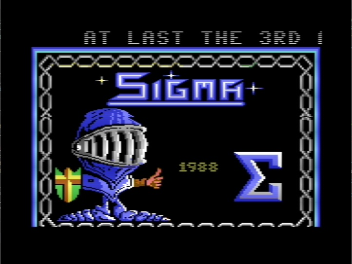

## Generic 3532
### Part-1:  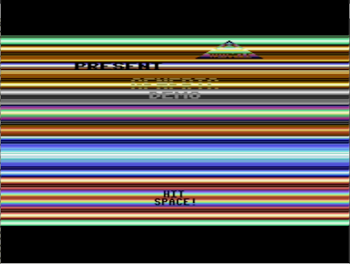
### Part-2:  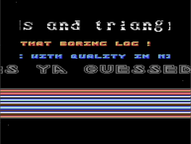
### Part-3:  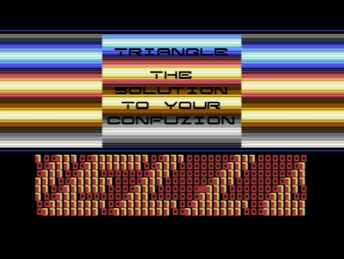

## JetBoys Cracktro
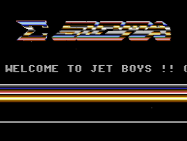

## Trantor Cracktro
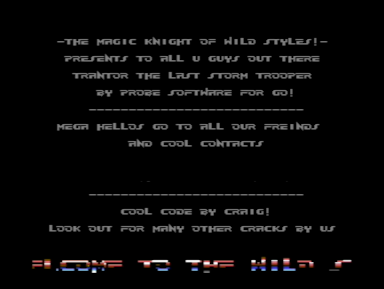

